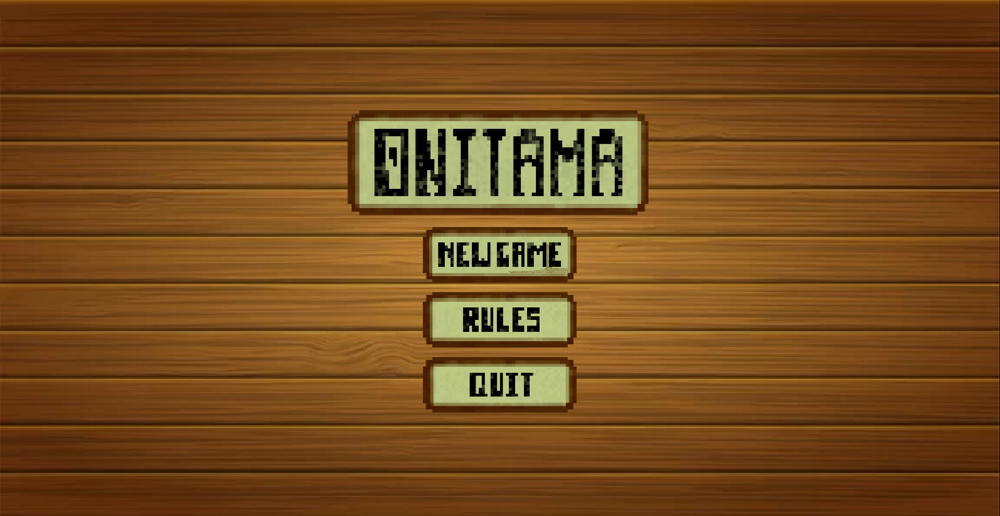
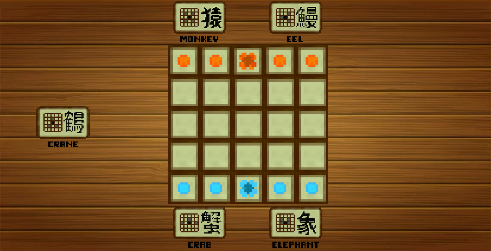

# CPSC 224 Final Project: Onitama
## Members: Alex, Caleb, Colin

# 🎮 Onitama - Virtual Re-creation

This project is a virtual re-creation of the strategic board game **Onitama**, designed in Java using the **Swing** library. It follows an object-oriented programming (OOP) approach and features **completely custom artwork** for all sprites. This version faithfully recreates the original game and does **not include any expansions**.

---

## 📸 Screenshots

### Game Menu


### Actual Game
)

---

## 🚀 Features

✅ Fully functional recreation of the original Onitama board game.  
✅ Custom graphics and sprites for all game elements.  
✅ Smooth turn-based gameplay with accurate game rules.  
✅ Simple and intuitive GUI with responsive interactions.  

---

## 🛠️ Installation and Setup

### Prerequisites
- Java 17 or higher
- Apache Maven 3.9.9 (or compatible version)

---

## 📦 Building the Project

Run the following command to build and package the project into a JAR file:
```bash
make package
'''


